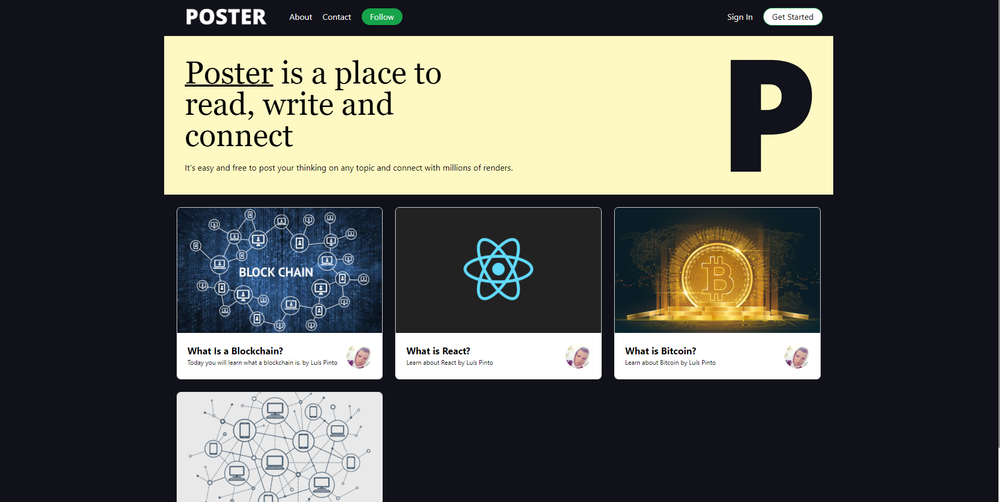

# Poster App

# 

This app is a full stack app, that shows the latest posts.

## Features:

- Commments: People can comment on the posts.
- Incremental Static Regeneration: Refreshes the website every 60 seconds so it stays up to date.
- Server side Rendering: The Website get prerendered on the server to improve load speed.
- Comment Checking: Once a comment is submited it gets revied by the moderator and then aproved.

> Check it out: [http://poster-app.vercel.app/](http://poster-app.vercel.app/)

## Tech:

- [React] - HTML enhanced for web apps!
- [Next] - React framework for production level apps
- [Vs Code] - A multi language code editor.
- [Tailwind Css] - A very usefull CSS Framework.

## License

MIT

**Free Software, Hell Yeah!**

[react]: https://reactjs.org/
[font awesome]: https://fontawesome.com/
[vs code]: https://code.visualstudio.com/
[next]: https://nextjs.org/
[tailwind]: https://tailwindcss.com/
